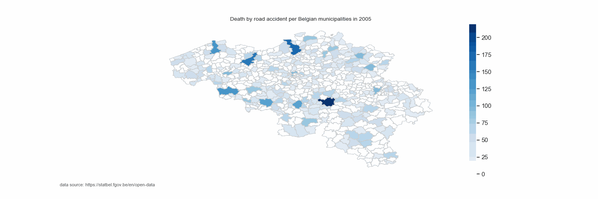
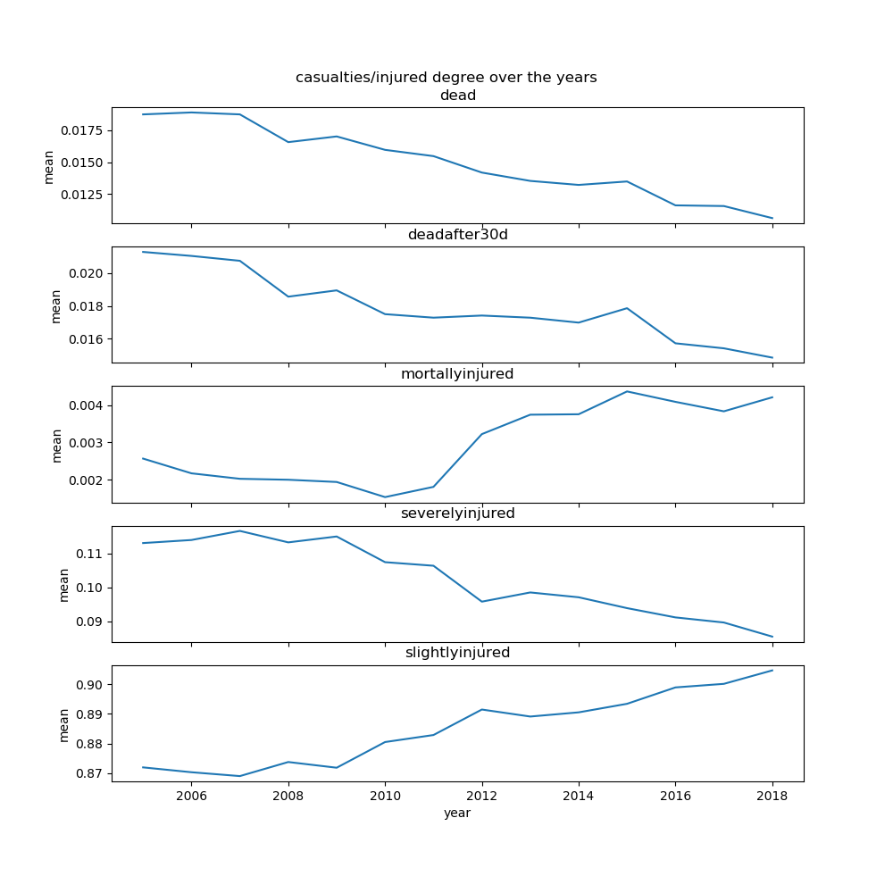

Explore dataset road accidents Belgium 2005-2018

Source: https://statbel.fgov.be/en/open-data

This data is made available under the 'Licentie open data' which is compatible with the Creative Commons Attribution 2.0 license https://creativecommons.org/licenses/by/2.0

project still ongoing...

