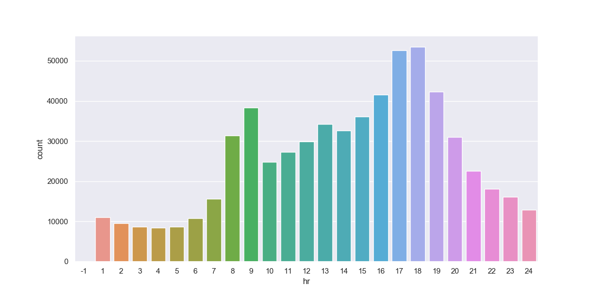

# Exploration dataset road accidents in Belgium 2005-2018

Source: https://statbel.fgov.be/en/open-data

This data is made available under the 'Licentie open data' which is compatible with the Creative Commons Attribution 2.0 license https://creativecommons.org/licenses/by/2.0

## Current findings (project ongoing)

### 1. Accidents per hour

<b>Noteworthy</b>: morning rush hour (8-9am) and evening rush hour (5-6pm)

  

### 2. Accidents per day of the week
<b>Noteworthy</b>: upward trend from monday to wednesday, thursday small drop with peak accidents on friday. Why? Do people get more tired when the week goes on? The drop on thursday due to working from home? Do people rush home on friday or exhausted from the week and therefor less concentrated? 
 <b>To do list +=</b> plot hours for only friday.

  

### 3. Accidents per year
<b>Noteworthy</b>: downward trend.

  

### 4. Accidents per quarter
<b>Noteworthy</b>: second quarter peak due to holidays? Easter + start of summer holiday

  

### 5. Accidents per month
<b>Noteworthy</b>: second quarter peak due to holidays? 9th and 10th month due to bad weather conditions? 
 <b>To do list +=</b> check for weather condition per month per municipality from 2005-2018

  

### 6. Change of mean values of time

-dead = number of accidents with dead 
-deadafter30d = number of accidents dead within 30 days 
-mortallyinjured = number of accidents with mortally injured 
-severlyinjured = number of accidents with severely injured 
-slightlyinjured = number of accidents with slightly injured 

<b>Beware of the different scale per plot!</b>

  

### 7. Total deaths per municipality 2005-2018
<b>Noteworthy</b>: Top 10

-Antwerp 199 
-Gent 142 
-Namur 130 
-Doornik 126 
-Charleroi 122 
-Liege 118 
-Mons 111 
-Bruxelles 78 
-Brugge 70 
-Genk 65 
 <b>To do list +=</b> why? Amount of inhabitants/munic. contribution
 <b>To do list +=</b> why? Amount of people traveling there for work.
 <b>To do list +=</b> barplot top 10 per year

  

### Changing deaths per municipality (gif)

  

