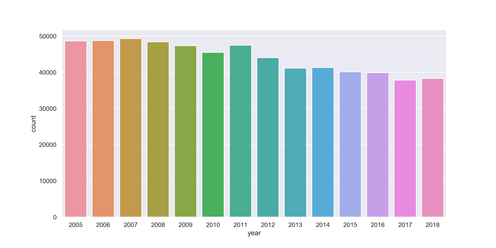
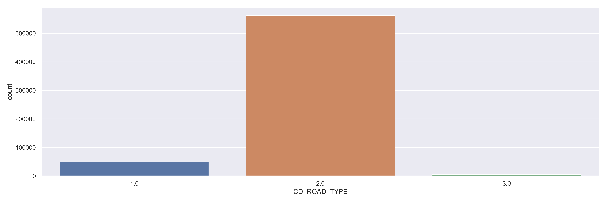
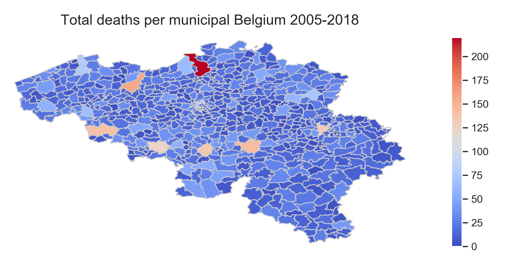

# Analysis of road accidents in Belgium 2005-2018 (ongoing)

### Data source

-https://statbel.fgov.be/en/open-data.  -License: 'Licentie open data' which is compatible with the Creative Commons Attribution 2.0 license https://creativecommons.org/licenses/by/2.0
### Objectives 

-look for patterns/major contributors to deadly accidents 
-where and why do most deadly accidents occur? 
-visualize map per municipality using geopandas 
-create model to make predictions 

### Beware

-Original dataset uses "dead" i.o. "death" 
-Project is ongoing, some plots may not look very nice, will be corrected for final results. 
-Parts still in Dutch will be translated to English 

## Current findings (project ongoing)

### GIF per year

  

### Hour vs. day of the week 

<b>Noteworthy</b>: morning rush hour (8-9am), evening rush hour (5-6pm) and most accidents on friday.

  

### Accidents per hour

<b>Noteworthy</b>: morning rush hour (8-9am) and evening rush hour (5-6pm)

  

### Accidents per day of the week
<b>Noteworthy</b>: upward trend from monday to wednesday, thursday small drop with peak accidents on friday. Why? Do people get more tired when the week goes on? The drop on thursday due to working from home? Do people rush home on friday or exhausted from the week and therefor less concentrated? To do: plot hours for only friday.

  

### Accidents per year
<b>Noteworthy</b>: downward trend.

  

### Accidents per quarter
<b>Noteworthy</b>: second quarter peak due to holidays? Easter + start of summer holiday

  

### Accidents per month
<b>Noteworthy</b>: second quarter peak due to holidays? 9th and 10th month due to bad weather conditions? To do:check for weather condition per month per municipality from 2005-2018

  

### Road type

  

<b>Translation</b>: xlabels 

1=regional road 
2=provincial road or municipal road 
3=motorway 

### Area

  

<b>Translation</b>: xlabels 
1 = outside built-up area (buiten de bebouwde kom) 
2 = inside built-up area (binnen de bebouwde kom) 
3 = not available 

### Collision type

  

<b>Translation</b>: xlabels 
1=Lateral 
2=Against an obstacle on the road 
3=Chain collision (4 drivers or more) 
4=From behind (or side by side) 
5=One driver/no obstacle 
6=Frontal impact (or when crossing) 
7=Against an obstacle on the road  
8=With a pedestrian 

### Light condition

  

<b>Translation</b>: xlabels 
1 = broad daylight, night 
2= lit public lighting 
3= not available 
4= dawn / dusk 
5= night / no public lighting 

### Change of mean values over time

-dead = number of accidents with death 
-deadafter30d = number of accidents causing death within 30 days 

<b>Beware of the different scale per plot!</b>

  

  

<b>Top 10</b>:

-Antwerp (199) 
-Gent (142) 
-Namur (130) 
-Doornik (126) 
-Charleroi (122) 
-Liege (118) 
-Mons (111) 
-Bruxelles (78) 
-Brugge (70) 
-Genk (65) 

